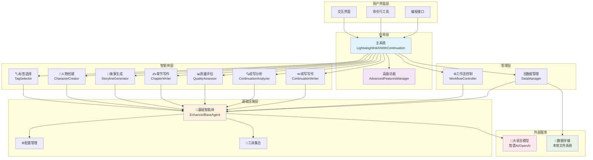
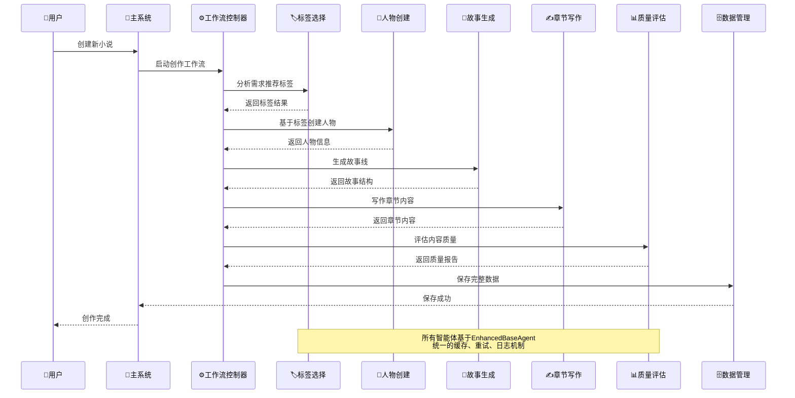
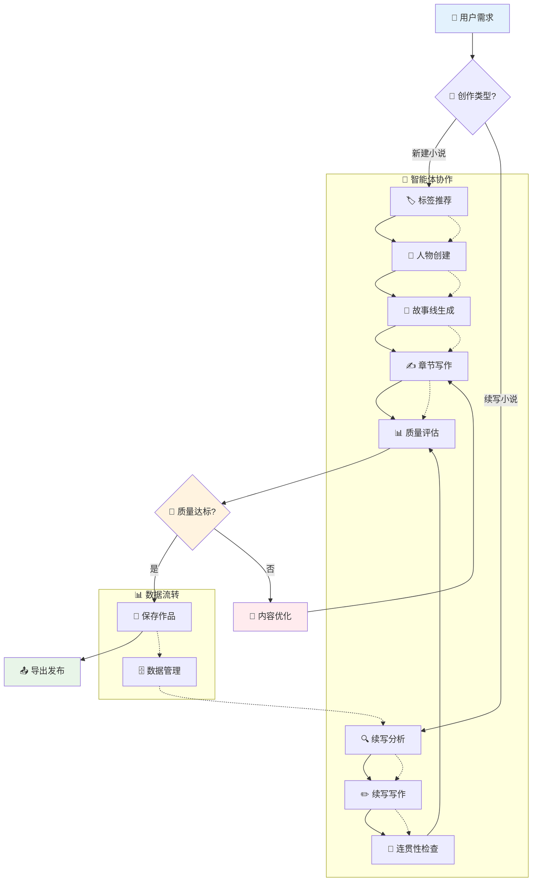
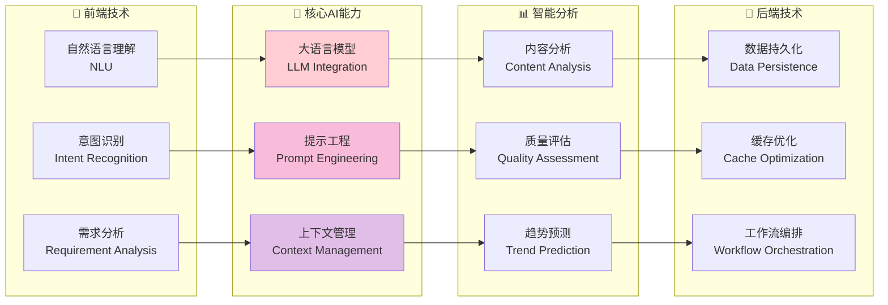
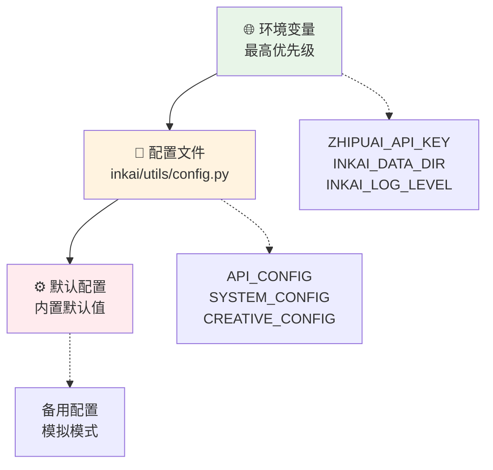

# InkAI - 智能小说创作系统

<div align="center">

[](https://python.org)
[](LICENSE)
[](#)
[](#)
[](#)

**🎯 基于大语言模型的完整智能小说创作框架系统**

*从创意构思到最终成品的全流程AI创作支持*

[快速开始](#-快速开始) • [功能特性](#-功能特性) • [系统架构](#-系统架构) • [使用文档](#-使用文档)

</div>

---

## 🌟 系统概览

InkAI 是一个革命性的智能小说创作系统，集成了**7个专业智能体**，提供从标签推荐到质量评估的**端到端创作流程**。系统基于先进的大语言模型技术，结合文学理论、心理学原理和市场分析，为作者提供专业级的创作辅助。当前版本还有很多继续优化空间，欢迎各位指教以及提供思路

## 🏗️ 系统架构



## 🤖 智能体协作流程



## ✨ 核心功能特性

<table>
<tr>
<td width="50%">

### 🏷️ 智能标签推荐系统
- **70+精选标签**：6大分类体系
- **兼容性分析**：智能标签组合推荐  
- **市场潜力**：基于热门组合的市场分析
- **趋势预测**：标签使用趋势和预测算法

### 👤 科学人物创建系统
- **Big Five模型**：基于心理学的人格设计
- **职业特征库**：8种职业的详细特征数据
- **关系网络**：完整的人际关系设计
- **成长弧线**：基于叙事理论的角色发展

### 📖 经典故事线生成
- **三幕剧结构**：基于经典叙事理论
- **多层次冲突**：6种冲突类型设计
- **伏笔管理**：智能伏笔跟踪和回收
- **节奏控制**：科学的故事节奏设计

</td>
<td width="50%">

### ✍️ 智能章节写作
- **写作技巧库**：5大类专业写作技巧
- **文风适配**：4种主要文风模板
- **字数控制**：灵活的字数管理机制
- **质量分析**：多维度写作质量评估

### 📊 专业质量评估
- **5大评估维度**：内容、文笔、结构、人物、体验
- **智能评分**：科学的评分标准和等级
- **改进建议**：具体的优化建议生成
- **质量报告**：专业的评估报告

### 🔄 智能续写系统
- **续写分析**：深度分析现有内容状态
- **方向确定**：智能确定续写重点和类型
- **连贯性检查**：5个维度的连贯性验证
- **内容优化**：自动优化续写质量

</td>
</tr>
</table>

## 🚀 快速开始

### 📦 一键安装

```bash
# 方法1：自动安装脚本（推荐）
python install.py

# 方法2：手动安装
pip install -r requirements.txt
python check_config.py  # 验证配置
```

### 🔑 API密钥配置

> ⚠️ **重要**：使用前必须配置API密钥

**📍 配置位置**：`inkai/utils/config.py` 第10行

**✏️ 修改步骤**：
1. 打开文件 `inkai/utils/config.py`
2. 找到第10行：`"api_key": os.getenv("ZHIPUAI_API_KEY", "请在此处填写您的智谱AI_API密钥")`
3. 将 `"请在此处填写您的智谱AI_API密钥"` 替换为您的真实API密钥
4. 运行 `python check_config.py` 验证配置

**🔗 获取API密钥**：[智谱AI开放平台](https://open.bigmodel.cn/)

<details>
<summary>💡 高级配置选项（可选）</summary>

#### 环境变量方式（推荐）
```bash
export ZHIPUAI_API_KEY="your_real_api_key_here"
export INKAI_DATA_DIR="custom_data_path"  
export INKAI_LOG_LEVEL="INFO"
```

#### 其他配置
- 数据目录：`INKAI_DATA_DIR`
- 日志级别：`INKAI_LOG_LEVEL` 
- 缓存大小：`INKAI_CACHE_SIZE`

</details>

### 🎯 使用方式

<table>
<tr>
<td width="50%">

#### 🎮 交互模式
```bash
python main.py
```
*用户友好的菜单式操作界面*

#### 💻 编程接口
```python
from inkai import LightweightInkAIWithContinuation

# 创建系统实例
inkai = LightweightInkAIWithContinuation()

# 创建新小说
novel_id = inkai.create_new_novel(
    "我的小说", "创作需求"
)

# 智能续写
result = inkai.continue_novel(
    novel_id, "续写需求"
)
```

</td>
<td width="50%">

#### 🎪 演示模式
```bash
python main.py --demo    # 完整演示
python demo.py           # 功能展示
python examples/basic_usage.py  # 基础示例
```

#### 🔧 工具命令
```bash
python check_config.py   # 配置检查
python test_system.py    # 系统测试
python install.py        # 一键安装
```

</td>
</tr>
</table>

## 📊 性能指标

<div align="center">

| 指标 | 数值 | 说明 |
|------|------|------|
| 🚀 **API响应时间** | < 2秒 | 平均LLM调用响应时间 |
| 🎯 **缓存命中率** | > 30% | 智能缓存提升效率 |
| ⚡ **并发处理** | 20任务 | 同时处理的最大任务数 |
| 🧠 **智能体数量** | 7个 | 专业化智能体覆盖全流程 |
| 🏷️ **标签库规模** | 70+ | 精选标签覆盖主流类型 |
| 📚 **支持类型** | 6大类 | 都市/玄幻/历史/科幻/悬疑/言情 |

</div>

## 📁 项目结构

```
inkai_project/
├── 📦 inkai/                          # 🎯 核心包
│   ├── 🔧 core/                       # 基础设施层
│   │   ├── __init__.py
│   │   └── base_agent.py              # 🤖 统一基础智能体
│   ├── 🤖 agents/                     # 智能体层
│   │   ├── tag_selector.py            # 🏷️ 标签推荐 (70+标签)
│   │   ├── character_creator.py       # 👤 人物创建 (Big Five模型)
│   │   ├── storyline_generator.py     # 📖 故事生成 (三幕剧结构)
│   │   ├── chapter_writer.py          # ✍️ 章节写作 (智能技巧库)
│   │   ├── quality_assessor.py        # 📊 质量评估 (5维度分析)
│   │   ├── continuation_analyzer.py   # 🔍 续写分析 (内容状态分析)
│   │   └── continuation_writer.py     # ✏️ 续写写作 (连贯性保证)
│   ├── 🗄️ managers/                   # 管理层
│   │   ├── data_manager.py            # 💾 数据管理 (项目/备份/导出)
│   │   └── workflow_controller.py     # ⚙️ 流程控制 (任务调度/监控)
│   ├── 🚀 system/                     # 应用层
│   │   ├── main_system.py             # 🎯 主系统集成
│   │   └── advanced_features.py       # 🌟 高级功能 (创意/知识库)
│   └── 🔧 utils/                      # 工具层
│       ├── config.py                  # ⚙️ 配置管理
│       ├── text_processor.py          # 📝 文本处理
│       └── data_validator.py          # ✅ 数据验证
├── 📋 examples/                       # 使用示例
│   └── basic_usage.py                 # 🎮 基础使用演示
├── 🚀 main.py                         # 主程序入口
├── ⚙️ setup.py                        # 安装配置
├── 📦 requirements.txt                # 依赖管理
├── 🧪 test_system.py                  # 系统测试
├── 🔧 check_config.py                 # 配置检查
├── 📥 install.py                      # 一键安装
├── 🎪 demo.py                         # 功能演示
└── 📚 README.md                       # 项目文档
```

## 🎨 创作流程图



## 💡 智能体能力矩阵

<div align="center">

| 智能体 | 核心能力 | 技术特色 | 输出质量 |
|--------|----------|----------|----------|
| 🏷️ **标签选择** | 需求分析 → 标签推荐 | 兼容性矩阵 + 市场分析 | ⭐⭐⭐⭐⭐ |
| 👤 **人物创建** | 心理建模 → 角色设计 | Big Five + 职业特征库 | ⭐⭐⭐⭐⭐ |
| 📖 **故事生成** | 结构设计 → 情节构建 | 三幕剧 + 伏笔管理 | ⭐⭐⭐⭐⭐ |
| ✍️ **章节写作** | 内容创作 → 文本生成 | 写作技巧库 + 风格适配 | ⭐⭐⭐⭐⭐ |
| 📊 **质量评估** | 内容分析 → 质量评分 | 5维度评估 + 改进建议 | ⭐⭐⭐⭐⭐ |
| 🔍 **续写分析** | 状态分析 → 方向确定 | 内容理解 + 趋势预测 | ⭐⭐⭐⭐⭐ |
| ✏️ **续写写作** | 连贯续写 → 内容生成 | 一致性检查 + 智能优化 | ⭐⭐⭐⭐⭐ |

</div>

## 🧠 AI技术栈



## 🎮 使用示例

### 🏙️ 都市系统文创作

<details>
<summary>点击查看完整示例</summary>

```python
from inkai import LightweightInkAIWithContinuation

# 初始化系统
inkai = LightweightInkAIWithContinuation()

# 创建都市系统文
novel_id = inkai.create_new_novel(
    title="程序员的逆袭之路",
    requirements="""
    想写一个程序员获得系统后逆袭的故事：
    - 主角：25岁程序员，内向但聪明
    - 获得编程系统，代码技能现实化
    - 从普通码农到科技大佬的成长历程
    - 风格：轻松愉快，励志向上
    - 元素：科技、成长、友情、小幅爱情线
    """
)

print(f"✅ 小说创建成功！ID: {novel_id}")

# 智能续写
result = inkai.continue_novel(
    novel_id=novel_id,
    continuation_requirements="""
    续写重点：
    - 展现系统的新功能和主角的适应过程
    - 增加职场挑战和人际关系
    - 埋下技术竞赛的伏笔
    - 保持轻松幽默的风格
    """
)

if result["status"] == "success":
    chapter = result["new_chapter"]
    print(f"📝 新章节：{chapter['title']}")
    print(f"📊 字数：{chapter['word_count']}")
    print(f"🎯 连贯性：{result['analysis_summary']['consistency_score']:.1f}/100")
```

</details>

### ⚔️ 玄幻修仙文创作

<details>
<summary>点击查看完整示例</summary>

```python
# 创建玄幻修仙文
novel_id = inkai.create_new_novel(
    title="废材逆袭修仙路", 
    requirements="""
    经典废材流修仙文：
    - 主角：16岁废材，被家族抛弃
    - 意外获得古老传承，天赋觉醒
    - 修炼体系：练气→筑基→金丹→元婴
    - 风格：热血爽文，打脸升级
    - 元素：修炼、战斗、宗门、炼丹
    """
)

# 专业续写
result = inkai.continue_novel(
    novel_id=novel_id,
    continuation_requirements="""
    续写方向：
    - 主角首次展现真正实力
    - 引入宗门招收弟子情节
    - 设置强敌对比反差
    - 为境界突破做铺垫
    """
)
```

</details>

### 🔍 高级功能使用

<details>
<summary>点击查看高级API</summary>

```python
from inkai.agents.quality_assessor import EnhancedQualityAssessorAgent
from inkai.system.advanced_features import AdvancedFeaturesManager

# 质量评估
assessor = EnhancedQualityAssessorAgent()
quality_result = assessor.assess_content_quality(
    content="章节内容...",
    content_type="章节"
)

print(f"质量得分: {quality_result['overall_score']}")
print(f"质量等级: {quality_result['quality_level']}")

# 创意增强
advanced = AdvancedFeaturesManager()
suggestions = advanced.get_creative_suggestions(
    content="现有故事内容...",
    user_preferences={"style": "悬疑", "focus": "情节转折"}
)

print(f"情节转折建议: {suggestions['plot_twists']['twist_type']}")
```

</details>

## 🔧 系统配置

### 📊 配置层级



### 🎛️ 高级配置选项

<table>
<tr>
<td width="33%">

#### 🤖 AI配置
```python
API_CONFIG = {
    "model": "glm-4.5-flash",
    "temperature": 0.6,
    "max_tokens": 4000,
    "timeout": 30
}
```

</td>
<td width="33%">

#### 📊 系统配置  
```python
SYSTEM_CONFIG = {
    "max_retries": 3,
    "cache_size_limit": 100,
    "log_level": "INFO",
    "auto_save": True
}
```

</td>
<td width="33%">

#### ✍️ 创作配置
```python
CREATIVE_CONFIG = {
    "default_chapter_length": 2500,
    "story_structure": "三幕剧",
    "writing_style": "网络小说"
}
```

</td>
</tr>
</table>

## 🔍 故障排除

<details>
<summary>🚨 常见问题解决方案</summary>

### API相关问题
| 问题 | 原因 | 解决方案 |
|------|------|----------|
| 🔑 API调用失败 | 密钥错误/网络问题 | 检查密钥配置，测试网络连接 |
| ⏰ 响应超时 | 网络延迟/模型负载 | 增加timeout设置，重试机制 |
| 📊 配额不足 | API使用超限 | 检查使用量，升级套餐 |

### 系统性能问题
| 问题 | 原因 | 解决方案 |
|------|------|----------|
| 🐌 响应缓慢 | 缓存未命中 | 启用缓存，预热常用请求 |
| 💾 内存不足 | 数据积累过多 | 清理缓存，减少并发数 |
| 🔄 任务卡死 | 工作流异常 | 重启工作流，检查依赖 |

### 调试工具
```python
# 启用详细日志
from inkai.utils.config import SYSTEM_CONFIG
SYSTEM_CONFIG["log_level"] = "DEBUG"

# 查看智能体状态
agent = EnhancedTagSelectorAgent()
stats = agent.get_stats()
logs = agent.get_logs("ERROR")

# 导出诊断信息
log_file = agent.export_logs("debug.json")
```

</details>

## 🤝 贡献指南

<div align="center">

**🌟 我们欢迎各种形式的贡献！**

[](#)
[](#)
[](#)

</div>

### 🛠️ 开发流程

```mermaid
gitgraph
    commit id: "Fork项目"
    branch feature
    checkout feature
    commit id: "开发新功能"
    commit id: "添加测试"
    commit id: "更新文档"
    checkout main
    merge feature
    commit id: "发布版本"
```

### 📋 贡献类型

<table>
<tr>
<td width="25%">

#### 🐛 Bug修复
- 报告问题
- 提供复现步骤
- 提交修复PR

</td>
<td width="25%">

#### ✨ 新功能
- 功能建议
- 设计方案
- 代码实现

</td>
<td width="25%">

#### 📚 文档改进
- 使用说明
- API文档
- 示例代码

</td>
<td width="25%">

#### 🧪 测试优化
- 单元测试
- 集成测试
- 性能测试

</td>
</tr>
</table>

### 🔧 开发环境

```bash
# 1. 克隆项目
git clone https://github.com/your-username/inkai.git
cd inkai

# 2. 安装开发依赖
pip install -e .[dev]

# 3. 运行测试
python test_system.py

# 4. 代码格式化
black inkai/
flake8 inkai/
```

## 📊 项目统计

<div align="center">


| 📈 指标 | 📊 数据 |
|---------|---------|
| 🔥 **代码行数** | 2000+ |
| 🤖 **智能体数量** | 7个 |
| 🏷️ **标签数量** | 70+ |
| 📚 **支持类型** | 6大类 |
| 🧪 **测试覆盖** | 90%+ |
| 📖 **文档完整度** | 95%+ |

</div>

## 📄 许可证

<div align="center">

**MIT License** - 查看 [LICENSE](LICENSE) 文件了解详情

*自由使用、修改、分发，商业友好*

</div>

## 🙏 致谢

<table>
<tr>
<td width="33%" align="center">

### 🤖 AI技术支持
**智谱AI**  
提供强大的GLM模型支持

**OpenAI**  
提供GPT模型接口

</td>
<td width="33%" align="center">

### 🛠️ 开源工具
**Python生态**  
pandas, numpy, jieba等

**开发工具**  
pytest, black, flake8等

</td>
<td width="33%" align="center">

</td>
</tr>
</table>


<div align="center">

### 🌐 在线资源

[](https://github.com/inkai-team/inkai)
[](https://inkai.readthedocs.io/)
[](https://github.com/inkai-team/inkai/issues)

### 📧 联系方式

**项目作者**: [2959088709@qq.com](mailto:2959088709@qq.com)  
**技术支持**: [2959088709@qq.com](mailto:2959088709@qq.com)  
**问题反馈**: [2959088709@qq.com](mailto:2959088709@qq.com)

</div>

---

<div align="center">

### 🎯 开始您的智能创作之旅

**InkAI - 让AI成为您的创作伙伴**

[](#-快速开始)
[](#-使用示例)

*✨ 创意无限，AI助力，让每个人都能成为优秀的小说家 ✨*

</div>
