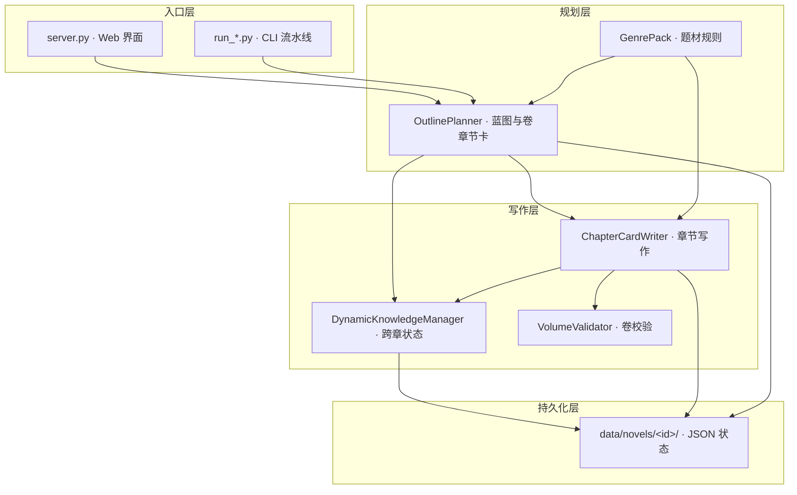

<div align="center">

# InkAI

### 基于大语言模型的中长篇小说自动创作系统

*从一句话到一千章 — 让 AI 写出结构完整、节奏稳定、长线连贯的小说*


[简介](#简介) · [快速开始](#快速开始) · [系统架构](#系统架构) · [核心机制](#核心机制) · [工程实践](#工程实践) · [项目结构](#项目结构)

</div>

---

## 简介

InkAI 是一个面向长篇小说的多智能体创作系统：从一句话的创意出发，自动生成整本书的蓝图、分卷章节卡，并逐章产出正文。系统由 33 个智能体和 42 个核心模块组成，覆盖大纲规划、章节写作、正典校验、全书审计的完整流水线。

长篇小说创作的核心约束是**长线一致性**：第 500 章不能推翻第 1 章的设定，第 1 章埋下的伏笔要在第 1000 章兑现，节奏和句式都不能在几十章后失控。InkAI 用三层机制保证这一点：

- **结构化卡片驱动**：规划器先产出结构化 ChapterCard（节奏定位、情节节拍、必现元素、伏笔编号、章末钩子），写作器在卡片约束下生成正文，并按硬校验规则验证，失败自动重写一次
- **跨章状态追踪**：DynamicKnowledgeManager 维护伏笔生命周期、角色持有物、常驻场景等跨章状态，每章生成前将状态快照注入 prompt
- **题材规则注入**：GenrePack 将题材风格规则（style_guide / banned_phrases / supporting_skeletons）全链路注入规划与写作阶段

支持 dashscope / deepseek / openai 三种 provider，主 LLM 可切换，embedding 与 rerank 独立配置。单章生成走 11 步流水线，全部状态以 JSON 持久化，支持断点续写与批量生成。

---

## 快速开始

### 环境要求

- Python 3.9+
- 阿里云百炼 / DeepSeek / OpenAI API Key（任选其一）

### 三步启动

```bash
# 1. 克隆 + 安装
git clone https://github.com/yan2959088709/InkAI-.git
cd InkAI-
pip install -r requirements.txt

# 2. 配置 API Key（环境变量）
export INKAI_API_KEY="sk-your-dashscope-key"
# 或 DeepSeek：export INKAI_PROVIDER="deepseek" && export INKAI_API_KEY="sk-your-deepseek-key"

# 3. 启动 Web 界面
python server.py
# 浏览器打开 http://127.0.0.1:5000
```

### CLI 流水线（批量生成）

```bash
# 初始化小说（元信息 + 人物 + 故事线）
python run_init_novel.py --genre xianxia --title "九霄道行" --protagonist "林朝歌"

# 生成蓝图 + 卷章节卡
python run_outline_demo.py --novel-id <id>

# 批量生成 1-10 章
python run_chapter_demo.py --novel-id <id> --start-chapter 1 --end-chapter 10

# 校验与审计（启发式规则，无 LLM 调用）
python run_validate_canon.py --novel-id <id>           # 人物/故事线一致性
python run_validate_volume.py --novel-id <id> --volume 1
python run_full_novel_audit.py --novel-id <id>         # 6 维全书审计
```

---

## 系统架构


```mermaid
flowchart TB
    subgraph Entry["入口层"]
        Web["server.py · Web 界面"]
        CLI["run_*.py · CLI 流水线"]
    end
    subgraph Plan["规划层"]
        OP["OutlinePlanner · 蓝图与卷章节卡"]
        GP["GenrePack · 题材规则"]
    end
    subgraph Write["写作层"]
        CCW["ChapterCardWriter · 章节写作"]
        DKM["DynamicKnowledgeManager · 跨章状态"]
        VV["VolumeValidator · 卷校验"]
    end
    subgraph Store["持久化层"]
        FS["data/novels/&lt;id&gt;/ · JSON 状态"]
    end
    Web --> OP
    CLI --> OP
    OP --> CCW
    OP --> DKM
    GP --> OP
    GP --> CCW
    CCW --> DKM
    CCW --> VV
    DKM --> FS
    CCW --> FS
    OP --> FS
```

状态以 JSON 持久化到 `data/novels/<novel_id>/`：

```
metadata.json          小说元信息
characters.json        人物档案
storyline.json         故事线
outline/
├── blueprint.json     整本蓝图（name_whitelist / global_foreshadow_ledger）
└── volume_<N>_chapters.json   卷章节卡
chapters_demo/
├── chapter_<N>.txt    章节正文
└── chapter_<N>.meta.json      章节元信息（含 validation）
dynamic_state/
└── state.json         DKM 状态
validation/
└── volume_<N>_report.json     卷校验报告
```

单章生成流水线（11 步）：

```
1.  定位卷 + 加载卷章节卡
2.  抽取本章 ChapterCard
3.  收集卷内已用钩子（banned_endings）
4.  加载近 N 章原文（承接锚点）
5.  DKM 快照（伏笔/人物/物品/场景状态）
6.  LLM 写作（system prompt 静态 + user prompt 动态）
7.  字数/主角/必现元素/禁用钩子校验
8.  失败重写一次（带反馈）
9.  落盘 + DKM 状态更新
10. 批量收尾：VolumeValidator 整卷校验
```

---

## 核心机制

### ChapterCardWriter：结构化卡片驱动写作

章节正文由结构化 ChapterCard 驱动生成。规划器先产出整本蓝图与分卷章节卡，每张卡片包含：

```python
{
  "chapter_number": 5,
  "title": "古玩造假",
  "role": "advancement",           # 缓冲/转折/强推
  "beats": ["主角鉴定古玩", "发现造假证据", "对手威胁"],
  "must_appear": {
    "characters": ["林朝歌", "苏婉清"],   # 硬失败：必须出场
    "objects": ["恐吓信"],               # 硬失败：必须原词出现
    "locations": ["古玩市场"]            # 软告警
  },
  "foreshadow_plant": ["F03"],     # 本章埋下的伏笔 ID
  "foreshadow_payoff": ["F01"],    # 本章兑现的伏笔 ID
  "ending_hook": "雨夜惊雷",        # 章末钩子（会被加入下章 banned_endings）
  "tension_level": 7
}
```

写作器在卡片约束下生成正文，并按以下规则硬校验，失败则携带反馈重写一次：

- 字数：目标 ±20%，硬上限 +30%
- 主角出现 ≥2 次
- `must_appear.characters` / `objects` 必须原词出现（同义词替换视为未出现）
- 章末 300 字不得命中 `banned_endings`（前几章已使用的钩子）

### DynamicKnowledgeManager：跨章状态追踪

DKM 维护跨章状态，每章写作前生成状态快照注入 prompt：

```
├── characters
│   ├── first/last_appearance          首末次出场
│   ├── appearance_chapters            出场章节列表
│   ├── total_mentions                 总提及次数
│   └── currently_holds                当前持有道具
├── objects
│   ├── holders_chain                  持有者链（A->B->C）
│   └── current_holder                 当前持有者
├── locations
│   ├── appearance_count               出现次数
│   └── is_recurring                   是否常驻（≥3 章）
└── foreshadowings
    ├── id (F01, F02, ...)             规范 ID（来自 blueprint.global_foreshadow_ledger）
    ├── status                         open / planted / closed / overdue
    └── age                            距埋设章数（>12 章 = overdue）
```

伏笔状态机：`open` → `planted`（埋设） → `closed`（兑现） / `overdue`（超期未兑现，触发警告）

### GenrePack：题材规则全链路注入

每个题材一个 JSON 包，定义写作规则，注入规划与写作全链路：

```bash
data/genres/
├── xianxia.json        # 仙侠：禁用现代词汇，要求境界体系
├── detective.json      # 悬疑：禁用超自然元素，要求线索公平性
└── campus_youth.json   # 校园青春：禁用暴力，要求青春期心理描写
```

包内字段：`style_guide` / `allowed_elements` / `forbidden_elements` / `banned_phrases` / `user_requirements_template` / `supporting_skeletons`。

### 多 Provider 与 Prompt Cache

支持 dashscope / deepseek / openai 三种 provider，主 LLM 与 embedding/rerank 分别配置。LLM 调用日志输出 prompt cache 命中率（DeepSeek `prompt_cache_hit_tokens` / OpenAI `cached_tokens`），用于诊断提示词结构对缓存命中率的影响。

---

## 工程实践

开源后收到 Issue #2（Eli-Zxh 2026-06-30；eirakezhao 2026-07-20）：

> 接入 deepseek-v4-flash 后缓存命中率是 0，怀疑是提示词工程问题。
> 在 config 里配置了 DEEPSEEK，结果 WEB 端一直提示失败。

**根因 1：缓存命中率 0%**

DeepSeek 的 prompt cache 基于前缀完全匹配。`chapter_card_writer._system_prompt` 将每章不同的动态内容（禁用钩子、目标字数）写入了 system prompt，导致前缀每章变化，缓存无法命中：

```python
# 修复前 — system prompt 含动态内容，每章都不同
base = (
    f"3. 严禁出现下列钩子句式：{banned_text}。\n"      # 每章 banned_text 不同
    f"4. 字数：{target_word_count}±20% 字。\n"         # 每章 target_word_count 可能不同
)
if cross_chapter_banned:
    base += f"以下句式已反复出现：{preview}"            # 每章 cross_chapter_banned 不同
```

修复：system prompt 静态化，动态内容移入 user prompt：

```python
# 修复后 — system prompt 只含静态内容
def _system_prompt(self, protagonist_name, name_whitelist):
    return (
        f"3. 严禁使用前几章已用过的钩子句式；具体禁用清单见 user prompt 中的【本章禁用钩子】。\n"
        f"4. 字数控制在目标值±20%；具体目标字数见 user prompt 中的【目标字数】。\n"
    )

def _build_user_prompt(self, ..., banned_endings, target_word_count, ...):
    banned_block = f"=== 本章禁用钩子 ===\n- {banned_endings}"
    target_block = f"=== 目标字数 ===\n{target_word_count} ±20%"
```

**根因 2：DeepSeek 配置失败**

`config.py` 中 embedding/rerank 复用主 LLM key。用户配置 DeepSeek key 后，embedding 仍调用 DashScope 端点，key 无效，依赖 embedding 的功能（知识图谱）失败：

```python
# 修复前 — embedding 复用主 key
EMBEDDING_API_KEY = os.environ.get("INKAI_API_KEY", "")  # DeepSeek key 不能用于 DashScope embedding
EMBEDDING_BASE_URL = "https://dashscope.aliyuncs.com/..."  # embedding 端点固定 DashScope
```

修复：provider 抽象 + embedding 独立配置 + host 比较诊断：

```python
# 修复后 — provider 抽象 + embedding 独立 key
PROVIDER_PRESETS = {
    "dashscope": {"base_url": "...", "model": "qwen3.6-plus", "embedding_base_url": "..."},
    "deepseek":  {"base_url": "...", "model": "deepseek-chat", "embedding_base_url": "dashscope..."},  # DeepSeek 不提供 embedding，回退 dashscope
    "openai":    {"base_url": "...", "model": "gpt-4o-mini", "embedding_base_url": "..."},
}

EMBEDDING_API_KEY = os.environ.get("INKAI_EMBEDDING_API_KEY", "") or API_KEY  # 独立 key，回退主 key

def _compute_embedding_status():
    """LLM 与 embedding 跨 host 且复用 key 时警告"""
    if llm_host != emb_host and EMBEDDING_API_KEY == API_KEY:
        return {"status": "warning", "message": "请配 INKAI_EMBEDDING_API_KEY"}
```

**修复成果**

- system prompt 静态化断言：构造两章不同动态数据，`system1 == system2`
- `/api/config` 返回 `embedding_status` 诊断（ok / warning / error），配置问题直接可见
- 老 config.json 与 dashscope 用户无感知，向后兼容

---

## 版本记录

| 版本 | 时间 | 变更 |
|------|------|------|
| v1.0 | 2025-09 | 5-agent 单点续写原型 |
| v1.10 | 2025-09 | 扩展至 25 agents，引入多入口 |
| v2.11 | 2026-04 | 重构流水线：删除多入口，引入 ChapterCardWriter / OutlinePlanner / GenrePack / DKM |
| 当前 | 2026-07 | 修复 prompt cache 命中与 provider 配置，新增多 provider 支持 |

---

## 项目结构

```
InkAI/
├── server.py                        # Web 服务入口（Flask）
├── base_agent.py                    # 智能体基类（LLM 调用 + 缓存诊断）
├── config.py                        # 多 provider 配置（dashscope/deepseek/openai）
├── run_*.py                         # CLI 流水线（9 个脚本）
├── agents/                          # 33 个智能体
│   ├── chapter_card_writer.py       #   章节卡写作（推荐）
│   ├── chapter_writer.py            #   旧版章节写作（保留）
│   ├── volume_validator.py          #   卷校验
│   ├── continuation_*.py            #   续写系列（评估 6 + 改进 6）
│   └── ...
├── core/                            # 42 个核心模块
│   ├── outline_planner.py           #   蓝图 + 卷章节卡规划
│   ├── genre_pack.py                #   题材包系统
│   ├── dynamic_knowledge_manager.py #   动态知识管理（DKM）
│   ├── api_rate_limiter.py          #   LLM 速率限制（2 并发 + 1s 间隔）
│   ├── canon_checker.py             #   正典校验
│   ├── full_novel_auditor.py        #   全书 6 维审计
│   └── ...
├── utils/                           # 工具（json_fixer / logger / type_safety）
├── data/genres/                     # 题材包 JSON（仙侠/悬疑/校园）
├── frontend/                        # 前端 SPA（Bootstrap 5 + Chart.js）
├── docs/                            # 文档
└── requirements.txt
```

---

## 多 Provider 配置

| Provider | `INKAI_PROVIDER` | BASE_URL | 默认模型 | Embedding |
|----------|------------------|----------|----------|-----------|
| 阿里云百炼（默认） | `dashscope` | dashscope.aliyuncs.com | qwen3.6-plus | text-embedding-v3（同 provider） |
| DeepSeek | `deepseek` | api.deepseek.com | deepseek-chat | 回退 dashscope（需独立 key） |
| OpenAI | `openai` | api.openai.com | gpt-4o-mini | text-embedding-3-small（同 provider） |

```bash
# 主 LLM 配置
INKAI_PROVIDER                      # dashscope / deepseek / openai（默认 dashscope）
INKAI_API_KEY                       # 主 LLM API key（必需）
INKAI_BASE_URL                      # 覆盖 provider preset 的 base_url
INKAI_MODEL                         # 覆盖 provider preset 的 model

# Embedding/Rerank 独立配置（LLM 非 dashscope 时必需）
INKAI_EMBEDDING_API_KEY             # embedding key（不配则回退主 key + warning）
INKAI_EMBEDDING_BASE_URL            # embedding base_url
INKAI_EMBEDDING_MODEL               # embedding 模型名
INKAI_RERANK_API_KEY                # rerank key
INKAI_RERANK_BASE_URL               # rerank base_url
```

配置诊断：

```bash
curl http://localhost:5000/api/config
```

```json
{
  "ok": true,
  "data": {
    "provider": "dashscope",
    "model": "qwen3.6-plus",
    "base_url": "https://dashscope.aliyuncs.com/compatible-mode/v1",
    "has_api_key": true,
    "api_key_preview": "sk-****...****",
    "available_providers": ["dashscope", "deepseek", "openai"],
    "has_embedding_key": false,
    "embedding_base_url": "https://dashscope.aliyuncs.com/compatible-mode/v1",
    "embedding_status": {"status": "ok", "message": ""}
  }
}
```

---

## 已知限制

- **无并发控制**：`data_manager.py` 写 JSON 无文件锁，并发请求可能损坏数据
- **无 API 输入校验**：`server.py` 部分端点直接传 raw payload 给 agent
- **Module-level 副作用**：`config.py` import 时创建目录，只读环境导入会失败
- **旧 pipeline 保留**：`inkai_workflow_optimized.py`（140KB 单体）冻结保留作为 rollback safety，新 pipeline 是推荐路径

---

## Roadmap

- [ ] 文件锁支持（解决并发写入）
- [ ] API 输入 schema 校验（pydantic）
- [ ] 向量检索增强（基于 Milvus 的语义回忆）
- [ ] 更多题材包（科幻 / 武侠 / 历史）
- [ ] 跨章句式去重（高频句式指纹注入禁用列表）
- [ ] 测试套件（pytest + 集成测试）

---

## 反馈与建议

Bug 报告、功能建议或任何其他反馈，欢迎通过邮箱联系：

- **邮箱**：[iudm0358@agent.qq.com](mailto:iudm0358@agent.qq.com)

---

## License

MIT
