# InkAI - 智能小说创作系统技术文档

## 系统概述

InkAI是基于大语言模型的智能小说创作系统，采用多智能体协作架构，支持从小说策划到章节续写的全流程自动化创作。

### 核心特性

- **🤖 多智能体协作**：25个专业智能体协同工作，各司其职
- **📚 全流程创作**：从标签选择到章节续写的完整创作链路
- **🎯 质量保证**：多层次质量评估与自动改进机制
- **🔄 智能续写**：基于知识图谱的智能续写功能
- **⚡ 高性能**：并行处理与智能缓存优化
- **🎨 专业界面**：现代化Web界面，支持实时创作监控

## 系统架构

### 整体架构图

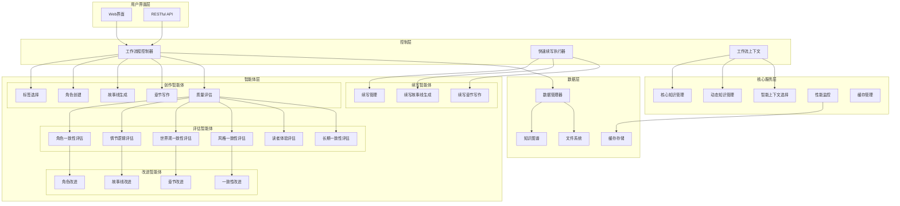

## 核心架构

```
InkAI/
├── agents/                    # 智能体模块 (25个)
├── core/                     # 核心服务模块
├── performance/              # 性能优化模块
├── optimization/             # 优化模块
├── data/                     # 数据存储
├── frontend/                 # Web界面
├── inkai_workflow_optimized.py    # 主工作流程控制器
├── quick_continuation_executor.py # 快速续写执行器
├── base_agent.py             # 基础智能体类
├── data_manager.py           # 数据管理器
├── workflow_context.py       # 工作流上下文
└── config.py                 # 配置文件
```

## 智能体系统架构

### 智能体分类体系

| 智能体类别 | 智能体数量 | 主要功能 | 协作方式 |
|------------|------------|----------|----------|
| **创作智能体** | 5个 | 新小说创作流程 | 顺序协作 |
| **续写智能体** | 3个 | 小说续写流程 | 顺序协作 |
| **评估智能体** | 6个 | 多维度质量评估 | 并行评估 |
| **改进智能体** | 11个 | 基于评估结果改进 | 按需触发 |

### 智能体交互模式

#### 1. 顺序协作模式
**适用场景**: 创作流程、续写流程
```
用户输入 → 标签选择 → 角色创建 → 故事线生成 → 章节写作 → 质量评估
```

#### 2. 并行评估模式
**适用场景**: 质量评估阶段
```
内容 → [角色一致性评估, 情节逻辑评估, 世界观一致性评估, 风格一致性评估, 读者体验评估, 长期一致性评估]
```

#### 3. 反馈改进模式
**适用场景**: 质量不达标时的改进流程
```
评估结果 → 改进建议 → 改进智能体 → 改进后内容 → 重新评估
```

### 智能体通信协议

#### 数据传递格式
```python
{
    "source_agent": str,           # 发送方智能体
    "target_agent": str,           # 接收方智能体
    "message_type": str,           # 消息类型: "request"|"response"|"notification"
    "data": Dict,                  # 具体数据
    "timestamp": str,              # 时间戳
    "correlation_id": str          # 关联ID
}
```

#### 错误处理机制
```python
{
    "success": bool,               # 操作是否成功
    "error_code": str,             # 错误代码
    "error_message": str,          # 错误信息
    "retry_count": int,            # 重试次数
    "fallback_data": Dict          # 降级数据
}
```

## 智能体系统详细规格

### 基础智能体类 (BaseAgent)

**文件位置**: `base_agent.py`

**核心方法**:
```python
class BaseAgent:
    def __init__(self, name: str)
    def call_llm(self, messages: List[Dict], temperature: float = None, max_tokens: int = None) -> str
    def parse_json_response(self, response: str) -> Dict[str, Any]
    def log(self, message: str)
```

**LLM调用配置**:
- 模型: GLM-4.5-flash
- 最大Token: 8192
- 温度: 0.6
- 重试次数: 3

**JSON解析机制**:
- 支持markdown格式JSON
- 自动修复常见JSON错误
- 失败时返回原始文本+错误标记

---

### 创作智能体 (Creation Agents)

#### 1. TagSelectorAgent - 标签选择智能体

**文件位置**: `agents/tag_selector.py`

**输入格式**:
```python
{
    "user_requirements": str,           # 用户创作需求
    "selected_tags": Dict[str, List[str]] # 可选：用户预选标签
}
```

**输出格式**:
```python
{
    "recommended_tags": {               # 推荐标签
        "类型标签": List[str],
        "主题标签": List[str], 
        "风格标签": List[str],
        "受众标签": List[str]
    },
    "selected_tags": {                  # 最终选定标签
        "类型标签": List[str],
        "主题标签": List[str],
        "风格标签": List[str], 
        "受众标签": List[str]
    },
    "tag_categories": Dict              # 完整标签库
}
```

**标签库规格**:
```python
TAG_CATEGORIES = {
    "类型标签": ["玄幻", "都市", "悬疑", "科幻", "言情", "历史", "军事", "武侠", "仙侠", "奇幻", "耽美", "百合", "轻小说", "同人", "游戏", "无限流", "系统", "修真", "灵异", "推理", "侦探", "西幻", "末世", "重生", "穿越", "历史架空", "军事战争", "科幻机甲", "赛博朋克", "克苏鲁"],
    "主题标签": ["复仇", "成长", "权谋", "治愈", "冒险", "爱情", "友情", "家庭", "职场", "校园", "救赎", "逆袭", "商战", "社会问题", "心理", "惊悚", "恐怖", "末日生存", "异能", "超能力", "时间旅行", "平行宇宙", "人工智能", "环保", "社会批判", "政治斗争", "经济斗争", "伦理", "探索", "寻宝", "谍战", "间谍", "悬疑解谜", "家庭伦理", "青春成长", "校园恋爱", "友情羁绊", "亲情", "爱情纠葛"],
    "风格标签": ["幽默诙谐", "严肃深刻", "文艺抒情", "热血激昂", "温馨治愈", "黑暗压抑", "轻松愉快", "悬疑紧张", "浪漫唯美", "冷峻写实", "奇幻瑰丽", "细腻描写", "快节奏", "慢节奏", "史诗感", "日常系", "沙雕", "虐心", "治愈系", "黑暗系", "现实主义", "超现实", "后现代", "哥特", "蒸汽朋克", "赛博朋克", "史诗", "轻松", "沉重", "光明", "冷酷", "讽刺", "荒诞", "诗意", "口语化", "叙事性强"],
    "受众标签": ["青少年", "成年人", "女性向", "男性向", "全年龄", "儿童向", "少女向", "少男向", "中年向", "老年向", "学生", "上班族", "家庭主妇", "退休人员", "LGBTQ+群体", "二次元爱好者", "科幻迷", "历史爱好者", "游戏爱好者", "动漫爱好者", "家庭向", "情侣向", "亲子向", "特定兴趣群体"]
}
```

#### 2. CharacterCreatorAgent - 角色创建智能体

**文件位置**: `agents/character_creator.py`

**输入格式**:
```python
{
    "selected_tags": Dict[str, List[str]],  # 选定标签
    "user_requirements": str,               # 用户需求
    "existing_characters": Dict,            # 可选：现有人物
    "user_modifications": Dict              # 可选：用户修改
}
```

**输出格式**:
```python
{
    "main_character": {
        "basic_info": {
            "name": str,                    # 姓名
            "age": int,                     # 年龄
            "gender": str,                  # 性别
            "occupation": str               # 职业
        },
        "personality": {
            "five_factors": {               # 五维人格
                "extraversion": int,        # 外向性 (1-10)
                "agreeableness": int,       # 宜人性 (1-10)
                "conscientiousness": int,   # 尽责性 (1-10)
                "neuroticism": int,         # 神经质 (1-10)
                "openness": int             # 开放性 (1-10)
            },
            "traits": List[str],            # 性格特质
            "strengths": List[str],         # 优势
            "weaknesses": List[str]         # 弱点
        },
        "appearance": {
            "height": str,                  # 身高
            "build": str,                   # 体型
            "hair": str,                    # 发色发型
            "eyes": str,                    # 眼睛
            "distinctive_features": List[str] # 标志特征
        },
        "background": {
            "family": str,                  # 家庭背景
            "education": str,               # 教育背景
            "important_events": List[str],  # 重要经历
            "current_situation": str        # 当前状况
        },
        "motivation": {
            "core_desire": str,             # 核心欲望
            "main_fear": str,               # 主要恐惧
            "current_goal": str,            # 当前目标
            "conflicts": List[str]          # 内心冲突
        },
        "skills": {
            "primary_skills": List[str],    # 主要技能
            "secondary_skills": List[str],  # 次要技能
            "hidden_abilities": List[str]   # 隐藏能力
        },
        "relationships": {
            "family": Dict[str, str],       # 家庭关系
            "friends": Dict[str, str],      # 朋友关系
            "enemies": Dict[str, str],      # 敌对关系
            "romantic": Dict[str, str]      # 感情关系
        }
    },
    "supporting_characters": [
        {
            "name": str,
            "role": str,                    # 角色定位
            "relationship_with_main": str,  # 与主角关系
            "personality": str,             # 性格描述
            "background": str,              # 背景简介
            "purpose_in_story": str         # 故事中的作用
        }
    ],
    "character_relationships": {
        "relationship_matrix": Dict,        # 关系矩阵
        "conflict_sources": List[str],      # 冲突来源
        "alliance_patterns": List[str]      # 联盟模式
    }
}
```

#### 3. StorylineGeneratorAgent - 故事线生成智能体

**文件位置**: `agents/storyline_generator.py`

**输入格式**:
```python
{
    "selected_tags": Dict[str, List[str]],  # 选定标签
    "characters": Dict,                     # 角色信息
    "user_requirements": str                # 用户需求
}
```

**输出格式**:
```python
{
    "overall_storyline": {
        "world_setting": {
            "time_period": str,             # 时代背景
            "location": str,                # 主要地点
            "society": str,                 # 社会结构
            "rules": str,                   # 世界规则
            "atmosphere": str               # 整体氛围
        },
        "main_goal": str,                   # 主角终极目标
        "core_conflict": {
            "external": str,                # 外在冲突
            "internal": str,                # 内在冲突
            "interpersonal": str            # 人际冲突
        },
        "act1": {
            "setup": str,                   # 第一幕设定
            "inciting_incident": str,       # 引发事件
            "key_events": List[str],        # 关键事件
            "character_introduction": str,  # 角色介绍
            "world_building": str,          # 世界观建立
            "ending": str                   # 第一幕结尾
        },
        "act2": {
            "confrontation": str,           # 第二幕冲突
            "obstacles": List[str],         # 障碍
            "character_development": str,   # 角色发展
            "midpoint_crisis": str,         # 中点危机
            "low_point": str,               # 低谷时刻
            "turning_point": str,           # 转折点
            "climax_preparation": str       # 高潮准备
        },
        "act3": {
            "climax": str,                  # 高潮对决
            "resolution": str,              # 冲突解决
            "character_transformation": str, # 角色转变
            "theme_revelation": str,        # 主题揭示
            "ending": str                   # 故事结局
        },
        "themes": List[str],                # 深层主题
        "tone": str,                        # 故事基调
        "target_audience": str,             # 目标读者
        "commercial_potential": str,        # 商业价值
        "adaptation_potential": str         # 改编潜力
    },
    "first_module": {
        "chapter_title": str,               # 章节标题
        "scene_setting": {
            "time": str,                    # 时间设定
            "location": str,                # 地点设定
            "atmosphere": str               # 氛围描述
        },
        "plot_points": [
            {
                "event": str,               # 事件描述
                "purpose": str,             # 事件目的
                "characters_involved": List[str], # 涉及角色
                "tension_level": int        # 紧张度 (1-10)
            }
        ],
        "character_interactions": [
            {
                "characters": List[str],    # 互动角色
                "interaction_type": str,    # 互动类型
                "purpose": str              # 互动目的
            }
        ],
        "key_events": List[str],            # 关键事件
        "conflicts": [
            {
                "type": str,                # 冲突类型
                "description": str,         # 冲突描述
                "resolution": str           # 解决方式
            }
        ],
        "foreshadowing": List[str],         # 伏笔设置
        "character_development": {
            "main_character": str,          # 主角发展
            "supporting_characters": str    # 配角发展
        },
        "chapter_ending": str,              # 章节结尾
        "next_chapter_hint": str            # 下章预告
    },
    "subplot_hints": List[str],             # 支线伏笔
    "story_structure": {
        "三幕剧": {
            "第一幕": {
                "setup": str,
                "length_ratio": float       # 篇幅比例
            },
            "第二幕": {
                "confrontation": str,
                "length_ratio": float
            },
            "第三幕": {
                "resolution": str,
                "length_ratio": float
            }
        }
    }
}
```

#### 4. ChapterWriterAgent - 章节写作智能体

**文件位置**: `agents/chapter_writer.py`

**输入格式**:
```python
{
    "chapter_info": Dict,                   # 章节信息
    "characters": Dict,                     # 角色信息
    "storyline": Dict,                      # 故事线
    "tags": Dict[str, List[str]],           # 标签
    "user_requirements": str                # 用户需求
}
```

**输出格式**:
```python
{
    "title": str,                           # 章节标题
    "content": str,                         # 章节正文 (2000-5000字)
    "summary": str,                         # 章节概要
    "key_events": List[str],                # 关键事件
    "character_development": str,           # 人物发展
    "foreshadowing": List[str],             # 伏笔设置
    "next_chapter_hint": str,               # 下章预告
    "consistency_notes": str,               # 一致性说明
    "word_count": int,                      # 字数统计
    "created_at": str                       # 创建时间
}
```

#### 5. QualityAssessorAgent - 质量评估智能体

**文件位置**: `agents/quality_assessor.py`

**输入格式**:
```python
{
    "content": Dict,                        # 评估内容
    "content_type": str,                    # 内容类型: "story"|"storyline"|"character"
    "previous_chapters": List[Dict],        # 可选：之前章节
    "overall_storyline": Dict,              # 可选：整体故事线
    "user_requirements": str                # 用户需求
}
```

**输出格式**:
```python
{
    "overall_score": int,                   # 总体评分 (0-100)
    "dimensions": {
        "plot_consistency": int,            # 情节连贯性 (0-100)
        "character_depth": int,             # 人物立体度 (0-100)
        "language_style": int,              # 语言风格 (0-100)
        "innovation_appeal": int            # 创新吸引力 (0-100)
    },
    "is_high_quality": bool,                # 是否高质量 (≥80分)
    "suggestions": List[str],               # 改进建议
    "strengths": List[str],                 # 优点
    "weaknesses": List[str],                # 缺点
    "assessment_details": str,              # 评估详情
    "quality_threshold": int                # 质量阈值
}
```

---

### 续写智能体 (Continuation Agents)

#### 6. NovelContinuationAgent - 续写管理智能体

**文件位置**: `agents/novel_continuation_agent.py`

**输入格式**:
```python
{
    "novel_id": str,                        # 小说ID
    "user_requirements": str                # 用户需求
}
```

**输出格式**:
```python
{
    "status": str,                          # 状态
    "novel_data": {
        "novel_info": {
            "novel_id": str,
            "title": str,
            "author": str,
            "created_at": str,
            "updated_at": str,
            "status": str
        },
        "chapters": List[Dict],             # 章节列表
        "character_profiles": Dict,         # 角色档案
        "storyline": Dict,                  # 故事线
        "tags": Dict                        # 标签
    },
    "knowledge_base": {
        "novel_info": Dict,                 # 小说信息
        "chapters": List[Dict],             # 章节数据
        "character_profiles": Dict,         # 角色档案
        "plot_lines": Dict,                 # 情节线
        "last_chapter_summary": Dict,       # 最后一章摘要
        "world_setting": str,               # 世界观设定
        "story_tone": str,                  # 故事基调
        "tags": Dict                        # 标签信息
    },
    "next_step": str                        # 下一步
}
```

#### 7. ContinuationStorylineGenerator - 续写故事线生成器

**文件位置**: `agents/continuation_storyline_generator.py`

**输入格式**:
```python
{
    "knowledge_base": Dict,                 # 知识库
    "user_requirements": str                # 用户需求
}
```

**输出格式**:
```python
{
    "success": bool,
    "status": str,
    "next_chapter_storyline": {
        "chapter_number": int,              # 章节号
        "chapter_title": str,               # 章节标题
        "scene_setting": {
            "time": str,                    # 时间设定
            "location": str,                # 地点设定
            "atmosphere": str,              # 氛围描述
            "weather": str                  # 天气状况
        },
        "plot_points": List[str],           # 情节要点
        "character_interactions": [
            {
                "characters": List[str],    # 角色列表
                "interaction_type": str,    # 互动类型
                "purpose": str              # 互动目的
            }
        ],
        "key_events": List[str],            # 关键事件
        "conflicts": [
            {
                "type": str,                # 冲突类型
                "description": str,         # 冲突描述
                "resolution": str           # 解决方式
            }
        ],
        "foreshadowing": List[str],         # 伏笔设置
        "character_development": {
            "main_character": str,          # 主角发展
            "supporting_characters": str    # 配角发展
        },
        "chapter_ending": str,              # 章节结尾
        "next_chapter_hint": str,           # 下章预告
        "writing_notes": str                # 写作注意事项
    },
    "next_step": str
}
```

#### 8. ContinuationChapterWriter - 续写章节写作器

**文件位置**: `agents/continuation_chapter_writer.py`

**输入格式**:
```python
{
    "storyline": Dict,                      # 故事线
    "knowledge_base": Dict,                 # 知识库
    "user_requirements": str                # 用户需求
}
```

**输出格式**:
```python
{
    "success": bool,
    "status": str,
    "chapter_content": {
        "title": str,                       # 章节标题
        "content": str,                     # 章节正文 (3000-5000字)
        "summary": str,                     # 章节概要
        "key_events": List[str],            # 关键事件
        "character_development": str,       # 人物发展
        "foreshadowing": List[str],         # 伏笔设置
        "next_chapter_hint": str,           # 下章预告
        "consistency_notes": str,           # 一致性说明
        "word_count": int,                  # 字数统计
        "created_at": str                   # 创建时间
    },
    "word_count": int,
    "writing_quality": {
        "word_count_score": int,            # 字数评分
        "dialogue_score": int,              # 对话评分
        "description_score": int,           # 描写评分
        "action_score": int,                # 动作评分
        "overall_score": int                # 总体评分
    }
}
```

---

### 质量评估智能体 (Quality Assessment Agents)

#### 9. ContinuationQualityAssessor - 续写质量评估器

**文件位置**: `agents/continuation_quality_assessor.py`

**输入格式**:
```python
{
    "continuation_content": Dict,           # 续写内容
    "original_knowledge_base": Dict,        # 原始知识库
    "content_type": str,                    # 内容类型: "story"|"storyline"
    "user_requirements": str                # 用户需求
}
```

**输出格式**:
```python
{
    "overall_score": int,                   # 总体评分 (0-100)
    "dimensions": {
        "character_consistency": int,       # 角色一致性 (0-100)
        "plot_continuity": int,             # 情节连贯性 (0-100)
        "world_consistency": int,           # 世界观一致性 (0-100)
        "foreshadowing_continuity": int,    # 伏笔延续性 (0-100)
        "style_consistency": int            # 风格一致性 (0-100)
    },
    "is_high_quality": bool,                # 是否高质量
    "suggestions": List[str],               # 改进建议
    "strengths": List[str],                 # 优点
    "weaknesses": List[str],                # 缺点
    "consistency_issues": List[str],        # 一致性问题
    "improvement_priority": List[str]       # 改进优先级
}
```

#### 10. 专项一致性评估智能体

**角色一致性评估** (`continuation_character_consistency_assessor.py`):
- 评估角色行为、语言、性格是否符合原设定
- 检测角色发展轨迹的合理性
- 识别角色矛盾和不一致之处

**情节逻辑评估** (`continuation_plot_logic_assessor.py`):
- 评估情节发展的逻辑性
- 检测情节漏洞和矛盾
- 验证伏笔和线索的连贯性

**世界观一致性评估** (`continuation_world_consistency_assessor.py`):
- 评估世界观设定的统一性
- 检测世界规则的一致性
- 验证环境描述的合理性

**风格一致性评估** (`continuation_style_consistency_assessor.py`):
- 评估写作风格的统一性
- 检测语言风格的连贯性
- 验证叙事语调的一致性

**读者体验评估** (`continuation_reader_experience_assessor.py`):
- 评估阅读体验的流畅性
- 检测情节节奏的合理性
- 验证情感共鸣的强度

**长期一致性评估** (`continuation_long_term_consistency_assessor.py`):
- 评估长期故事的连贯性
- 检测角色发展的长期合理性
- 验证整体故事线的统一性

---

### 改进智能体 (Improvement Agents)

#### 11. 内容改进智能体

**角色改进** (`character_improver.py`):
- 输入: 角色数据 + 评估结果 + 改进建议
- 输出: 改进后的角色设定

**故事线改进** (`storyline_improver.py`):
- 输入: 故事线 + 评估结果 + 改进建议  
- 输出: 改进后的故事线

**章节改进** (`continuation_chapter_improver.py`):
- 输入: 章节内容 + 评估结果 + 改进建议
- 输出: 改进后的章节内容

#### 12. 一致性改进智能体

所有一致性改进智能体的输入输出格式:

**输入格式**:
```python
{
    "content": Dict,                        # 待改进内容
    "consistency_assessment": Dict,         # 一致性评估结果
    "improvement_suggestions": List[str],   # 改进建议
    "knowledge_base": Dict                  # 知识库
}
```

**输出格式**:
```python
{
    "improved_content": Dict,               # 改进后内容
    "improvement_summary": str,             # 改进摘要
    "changes_made": List[str],              # 具体修改
    "consistency_score": int,               # 改进后一致性评分
    "remaining_issues": List[str]           # 剩余问题
}
```

---

## 系统工作流程

### 1. 新小说创作流程

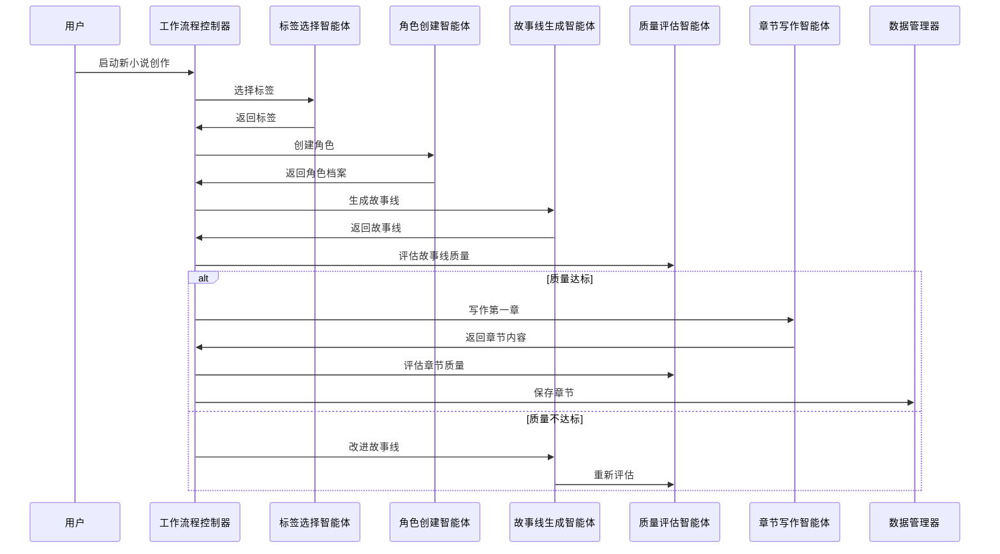

### 2. 小说续写流程

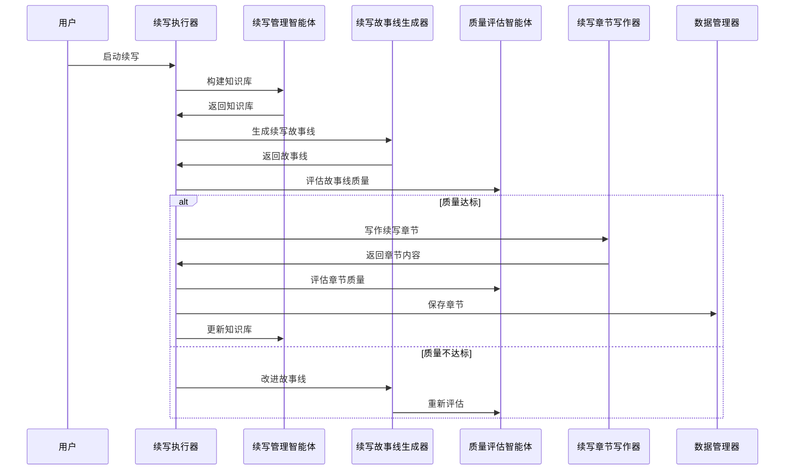

### 3. 质量评估与改进流程

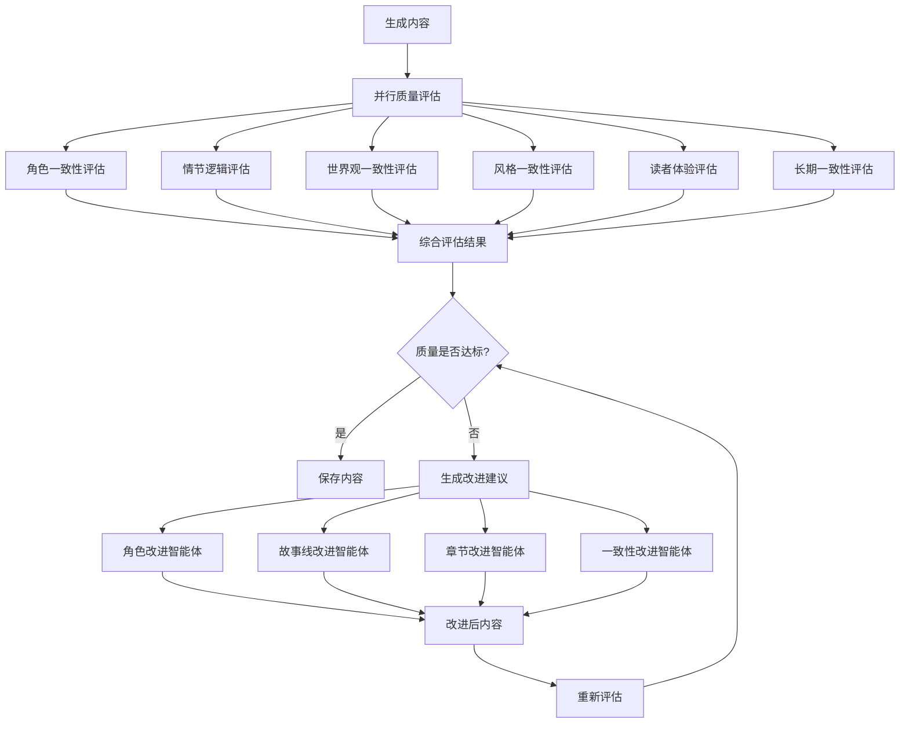

### 4. 知识管理流程

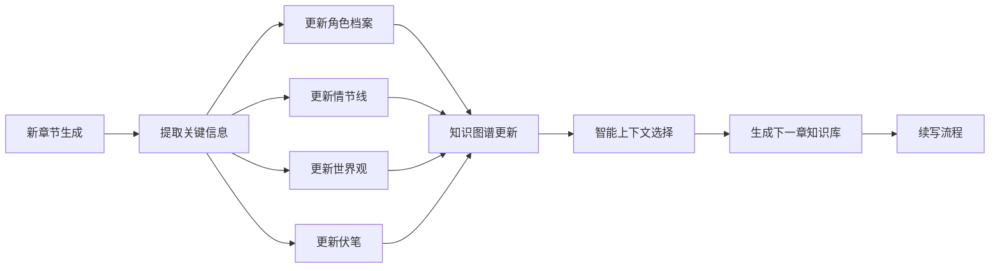

## 核心服务模块

### 1. 工作流程控制器

**文件位置**: `inkai_workflow_optimized.py`

**主要方法**:
```python
class InkAIWorkflowOptimized:
    def start_new_novel(self, user_requirements: str, title: str) -> Dict
    def select_tags(self, selected_tags: Dict) -> Dict
    def create_characters(self) -> Dict
    def generate_storyline(self) -> Dict
    def write_first_chapter(self) -> Dict
    def start_novel_continuation(self, novel_id: str, user_requirements: str) -> Dict
    def generate_continuation_storyline(self, novel_id: str) -> Dict
    def write_continuation_chapter(self, novel_id: str) -> Dict
    def assess_continuation_quality(self, novel_id: str, content_type: str) -> Dict
```

### 2. 快速续写执行器

**文件位置**: `quick_continuation_executor.py`

**主要方法**:
```python
class QuickContinuationExecutor:
    def start_quick_continuation(self, novel_id: str, mode: str, chapter_count: int) -> Dict
    def get_progress(self, novel_id: str) -> QuickContinuationProgress
    def stop_task(self, novel_id: str) -> Dict
    def pause_task(self, novel_id: str) -> Dict
    def resume_task(self, novel_id: str) -> Dict
```

**续写流程**:
1. 生成续写故事线
2. 评估故事线质量
3. 写作章节内容
4. 评估章节质量
5. 保存章节
6. 验证字数 (≥2000字)

### 3. 数据管理器

**文件位置**: `data_manager.py`

**主要方法**:
```python
class DataManager:
    def create_novel_project(self, novel_data: Dict) -> str
    def save_novel_data(self, novel_id: str, data_type: str, data: Dict) -> bool
    def load_novel_data(self, novel_id: str, data_type: str) -> Dict
    def save_chapter(self, novel_id: str, chapter_number: int, chapter_content: Dict) -> bool
    def get_chapters(self, novel_id: str) -> List[Dict]
    def create_knowledge_graph(self, novel_id: str, characters: Dict, storyline: Dict) -> str
```

**数据存储结构**:
```
data/
├── novels/
│   └── {novel_id}/
│       ├── metadata.json              # 元数据
│       ├── tags.json                  # 标签
│       ├── characters.json            # 角色
│       ├── storyline.json             # 故事线
│       ├── chapter_001.json           # 章节数据
│       ├── chapter_002.json
│       ├── chapters/                  # 章节文本
│       │   ├── chapter_001.txt
│       │   └── chapter_002.txt
│       └── *_quality_assessment.json  # 质量评估
└── knowledge_graphs/
    └── {kg_id}.json                   # 知识图谱
```

### 4. 工作流上下文

**文件位置**: `workflow_context.py`

**数据结构**:
```python
class WorkflowContext:
    novel_id: str                       # 小说ID
    user_requirements: str              # 用户需求
    title: str                          # 标题
    tags: Dict                          # 标签
    characters: Dict                    # 角色
    storyline: Dict                     # 故事线
    knowledge_graph_id: str             # 知识图谱ID
    current_step: str                   # 当前步骤
    is_continuation: bool               # 是否续写模式
    continuation_data: Dict             # 续写数据
    _cache: Dict                        # 缓存
    _quality_assessments: Dict          # 质量评估缓存
```

---

## 配置文件

**文件位置**: `config.py`

```python
# API配置
API_KEY = "your_glm_api_key"
MODEL_NAME = "glm-4.5-flash"
TEMPERATURE = 0.6
MAX_TOKENS = 8192
CHAPTER_MAX_TOKENS = 8192

# 嵌入模型配置
EMBEDDING_API_KEY = "your_embedding_api_key"
EMBEDDING_BASE_URL = "https://api.siliconflow.cn/v1"
EMBEDDING_MODEL = "BAAI/bge-m3"

# 质量评估标准
QUALITY_THRESHOLD = 80
QUALITY_DIMENSIONS = {
    "情节连贯性": {"weight": 0.3, "description": "无前后矛盾，伏笔100%呼应"},
    "人物立体度": {"weight": 0.25, "description": "角色情绪变化自然，动机合理"},
    "语言风格": {"weight": 0.25, "description": "符合标签的紧张感"},
    "创新吸引力": {"weight": 0.2, "description": "读者停留率>60%，点赞率>30%"}
}

# 文件路径配置
DATA_DIR = "data"
NOVELS_DIR = "data/novels"
KNOWLEDGE_GRAPHS_DIR = "data/knowledge_graphs"
TEMPLATES_DIR = "templates"
```

---

## 功能流程详解

### 1. 智能体构建流程

#### 智能体初始化流程
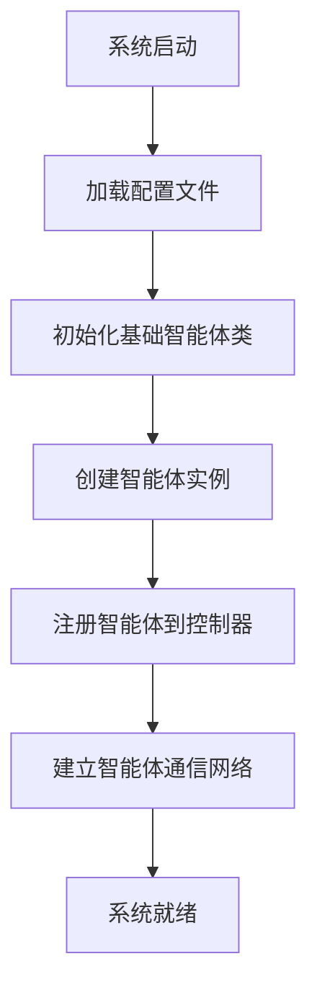

#### 智能体协作构建
```python
# 智能体构建示例
class AgentBuilder:
    def __init__(self):
        self.agents = {}
        self.workflow = None
    
    def build_creation_agents(self):
        """构建创作智能体"""
        self.agents['tag_selector'] = TagSelectorAgent()
        self.agents['character_creator'] = CharacterCreatorAgent()
        self.agents['storyline_generator'] = StorylineGeneratorAgent()
        self.agents['chapter_writer'] = ChapterWriterAgent()
        self.agents['quality_assessor'] = QualityAssessorAgent()
    
    def build_continuation_agents(self):
        """构建续写智能体"""
        self.agents['novel_continuation'] = NovelContinuationAgent()
        self.agents['continuation_storyline'] = ContinuationStorylineGenerator()
        self.agents['continuation_chapter'] = ContinuationChapterWriter()
    
    def build_assessment_agents(self):
        """构建评估智能体"""
        self.agents['character_consistency'] = ContinuationCharacterConsistencyAssessor()
        self.agents['plot_logic'] = ContinuationPlotLogicAssessor()
        self.agents['world_consistency'] = ContinuationWorldConsistencyAssessor()
        self.agents['style_consistency'] = ContinuationStyleConsistencyAssessor()
        self.agents['reader_experience'] = ContinuationReaderExperienceAssessor()
        self.agents['long_term_consistency'] = ContinuationLongTermConsistencyAssessor()
    
    def build_improvement_agents(self):
        """构建改进智能体"""
        self.agents['character_improver'] = CharacterImprover()
        self.agents['storyline_improver'] = StorylineImprover()
        self.agents['chapter_improver'] = ContinuationChapterImprover()
        # ... 其他改进智能体
```

### 2. 数据流转流程

#### 创作阶段数据流
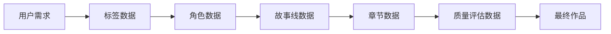

#### 续写阶段数据流
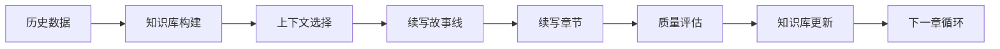

### 3. 错误处理与恢复流程

#### 智能体错误处理
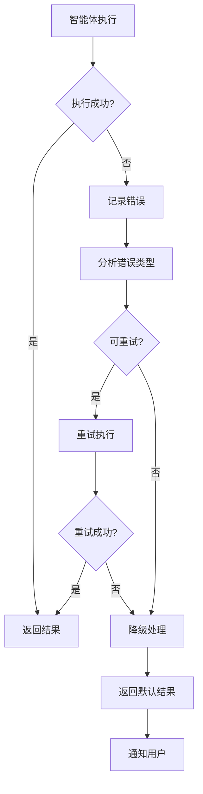

#### 系统恢复机制
```python
class SystemRecovery:
    def __init__(self):
        self.recovery_strategies = {
            'llm_timeout': self._handle_llm_timeout,
            'json_parse_error': self._handle_json_error,
            'quality_failure': self._handle_quality_failure,
            'memory_overflow': self._handle_memory_issue
        }
    
    def recover(self, error_type: str, context: Dict) -> Dict:
        """系统恢复主方法"""
        if error_type in self.recovery_strategies:
            return self.recovery_strategies[error_type](context)
        else:
            return self._default_recovery(context)
```

### 4. 性能优化流程

#### 并行处理流程
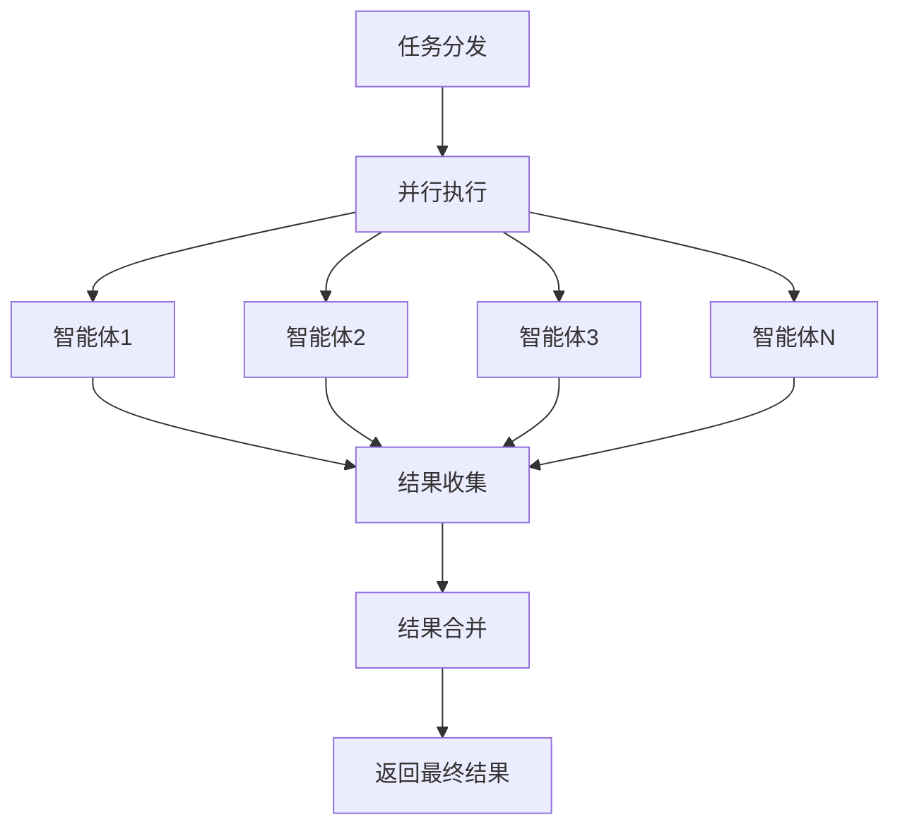

#### 缓存管理流程
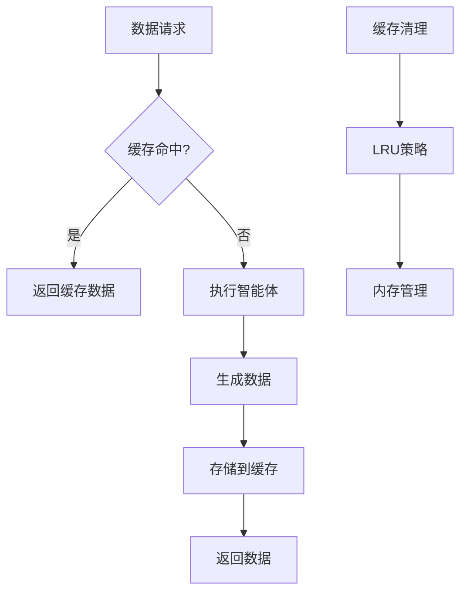

## API接口

### Web服务启动

```bash
python start_web.py
```

**服务地址**: http://localhost:5000

### 主要接口

#### 1. 创建新小说
```http
POST /api/novels
Content-Type: application/json

{
    "title": "小说标题",
    "user_requirements": "创作需求"
}
```

#### 2. 选择标签
```http
POST /api/novels/{novel_id}/tags
Content-Type: application/json

{
    "selected_tags": {
        "类型标签": ["玄幻", "系统"],
        "主题标签": ["成长", "逆袭"],
        "风格标签": ["热血激昂", "悬疑紧张"],
        "受众标签": ["青少年", "成年人"]
    }
}
```

#### 3. 创建角色
```http
POST /api/novels/{novel_id}/characters
```

#### 4. 生成故事线
```http
POST /api/novels/{novel_id}/storyline
```

#### 5. 写作第一章
```http
POST /api/novels/{novel_id}/chapters
```

#### 6. 启动续写
```http
POST /api/novels/{novel_id}/continue
Content-Type: application/json

{
    "mode": "continuous",
    "continuous_mode": "auto",
    "requirements": "续写需求"
}
```

#### 7. 获取续写状态
```http
GET /api/novels/{novel_id}/continue/status
```

#### 8. 停止续写
```http
POST /api/novels/{novel_id}/continue/stop
```

---

## 部署指南

### 环境要求
- Python 3.8+
- 8GB+ RAM
- 稳定网络连接
- 智谱AI API密钥
- SiliconFlow API密钥（用于嵌入模型）

### 安装步骤
```bash
# 1. 克隆项目
git clone https://github.com/your-repo/inkai.git
cd inkai

# 2. 安装依赖
pip install -r requirements.txt

# 3. 配置API密钥
# 编辑 config.py 文件
API_KEY = "your_glm_api_key"
EMBEDDING_API_KEY = "your_embedding_api_key"

# 4. 初始化数据目录
mkdir -p data/novels data/knowledge_graphs logs

# 5. 启动服务
python start_web.py
```

### 依赖包
```
flask==2.3.3
zhipuai==2.0.1
requests==2.31.0
numpy==1.24.3
pandas==2.0.3
```

### 系统架构部署

#### 单机部署
```bash
# 启动所有服务
python start_web.py
```

#### 分布式部署
```bash
# 启动Web服务
python start_web.py --port 5000

# 启动工作流服务
python inkai_workflow_optimized.py --worker

# 启动续写服务
python quick_continuation_executor.py --daemon
```

### 监控与维护

#### 系统监控
```python
# 性能监控
from performance.performance_monitor import PerformanceMonitor
monitor = PerformanceMonitor()
monitor.start_monitoring()

# 日志监控
tail -f logs/app.log
tail -f logs/error.log
tail -f logs/performance.log
```

#### 数据备份
```bash
# 备份小说数据
tar -czf backup_$(date +%Y%m%d).tar.gz data/

# 备份知识图谱
cp -r data/knowledge_graphs/ backup/kg_$(date +%Y%m%d)/
```

---

## 故障排除

### 常见问题

1. **API调用失败**
   - 检查API密钥配置
   - 验证网络连接
   - 查看API额度

2. **JSON解析错误**
   - 检查LLM输出格式
   - 查看base_agent.py的解析逻辑
   - 调整提示词格式

3. **内存不足**
   - 减少缓存大小
   - 启用垃圾回收
   - 调整并行处理数量

4. **生成质量下降**
   - 降低温度参数
   - 提高质量阈值
   - 检查知识库更新

### 日志文件
- 应用日志: `logs/app.log`
- 错误日志: `logs/error.log`
- 性能日志: `logs/performance.log`

---

## 开发指南

### 添加新智能体

1. 继承BaseAgent类
2. 实现process方法
3. 定义输入输出格式
4. 添加到agents/__init__.py
5. 在workflow中集成

### 修改工作流程

1. 编辑inkai_workflow_optimized.py
2. 添加新的步骤处理
3. 更新workflow_context.py
4. 修改前端界面

### 扩展质量评估

1. 创建新的评估智能体
2. 定义评估维度
3. 实现评估逻辑
4. 集成到评估流程

---

## 系统扩展指南

### 添加新的智能体类型

#### 1. 创建新智能体
```python
# 示例：创建新的评估智能体
from base_agent import BaseAgent

class CustomAssessmentAgent(BaseAgent):
    def __init__(self):
        super().__init__("自定义评估智能体")
    
    def process(self, input_data: Dict[str, Any]) -> Dict[str, Any]:
        # 实现自定义评估逻辑
        pass
```

#### 2. 注册到系统
```python
# 在 agents/__init__.py 中添加
from .custom_assessment_agent import CustomAssessmentAgent

# 在 __all__ 列表中添加
__all__ = [
    # ... 现有智能体
    'CustomAssessmentAgent'
]
```

#### 3. 集成到工作流
```python
# 在 inkai_workflow_optimized.py 中集成
def custom_assessment(self, novel_id: str) -> Dict[str, Any]:
    result = self.custom_assessment_agent.process({
        "novel_id": novel_id,
        "content": self.context.get_data("content")
    })
    return result
```

### 扩展工作流程

#### 添加新的工作流步骤
```python
# 在工作流控制器中添加新步骤
def custom_processing_step(self, novel_id: str) -> Dict[str, Any]:
    """自定义处理步骤"""
    # 1. 获取上下文数据
    context_data = self.context.get_data("custom_context")
    
    # 2. 调用相关智能体
    result = self.custom_agent.process(context_data)
    
    # 3. 更新上下文
    self.context.set_data("custom_result", result)
    
    # 4. 返回结果
    return {"success": True, "result": result}
```

### 自定义质量评估维度

#### 添加新的评估维度
```python
# 在 config.py 中扩展
QUALITY_DIMENSIONS = {
    "情节连贯性": {"weight": 0.3, "description": "无前后矛盾，伏笔100%呼应"},
    "人物立体度": {"weight": 0.25, "description": "角色情绪变化自然，动机合理"},
    "语言风格": {"weight": 0.25, "description": "符合标签的紧张感"},
    "创新吸引力": {"weight": 0.2, "description": "读者停留率>60%，点赞率>30%"},
    "自定义维度": {"weight": 0.1, "description": "自定义评估标准"}  # 新增
}
```

### 性能优化扩展

#### 添加新的缓存策略
```python
# 在 performance/intelligent_cache_manager.py 中扩展
class CustomCacheStrategy:
    def __init__(self):
        self.cache_policies = {
            'lru': self._lru_policy,
            'custom': self._custom_policy  # 新增策略
        }
    
    def _custom_policy(self, data: Dict) -> bool:
        """自定义缓存策略"""
        # 实现自定义缓存逻辑
        pass
```

## 最佳实践

### 智能体设计原则

1. **单一职责原则**：每个智能体只负责一个特定功能
2. **接口标准化**：所有智能体使用统一的输入输出格式
3. **错误处理**：完善的错误处理和降级机制
4. **性能优化**：合理使用缓存和并行处理
5. **可测试性**：每个智能体都应该有对应的测试用例

### 工作流设计原则

1. **模块化设计**：每个步骤独立且可复用
2. **状态管理**：清晰的状态转换和数据传递
3. **错误恢复**：支持从任意步骤重新开始
4. **监控日志**：完整的操作日志和性能监控
5. **扩展性**：易于添加新步骤和修改现有流程

### 数据管理原则

1. **数据一致性**：确保数据的完整性和一致性
2. **版本控制**：支持数据版本管理和回滚
3. **备份策略**：定期备份重要数据
4. **权限控制**：合理的数据访问权限管理
5. **性能优化**：高效的数据存储和检索

## 许可证

MIT License - 详见 [LICENSE](LICENSE) 文件

---

<div align="center">

**InkAI - 智能小说创作系统**

*让AI成为你的创作伙伴*

</div>
